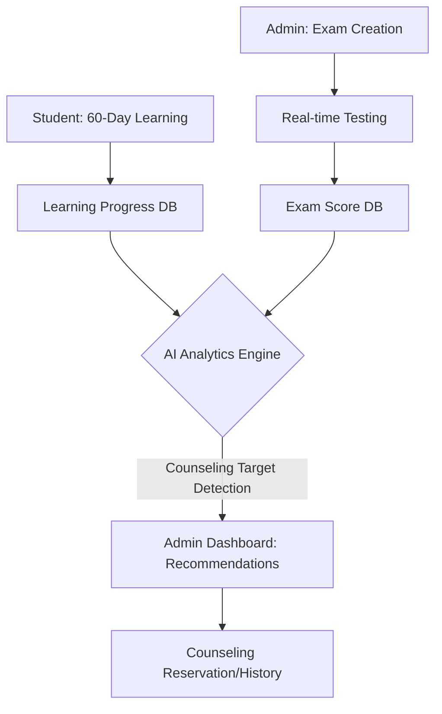

# 📘 [Project] Voca-Master: AI 기반 통합 편입영어 학습 관리 시스템
> **지능형 성취도 분석 및 AI 상담 추천 알고리즘 기반 에듀테크 솔루션**

[](https://example.com)
[](https://openai.com)
[](https://nextjs.org)

---

## 1. 개요 (Introduction)
*   **대상:** 고난도 어휘 습득과 체계적인 학습 관리가 필수적인 **편입 영어 수험생 및 교육 운영진**
*   **핵심 가치:** 60일 완성 커리큘럼(3,000단어)을 기반으로 학생의 학습 성취도를 정밀 추적하고, **AI 분석을 통해 상담 및 밀착 관리가 필요한 학생을 선제적으로 선별**하여 교육 효율을 극대화함.
*   **공모전 주제:** AI 활용 차세대 교육 솔루션 (교강사의 관리 페인 포인트 해결에 집중)

---

## 2. 주요 기능 (Core Features)

### 🎓 학생용: 60-Day 맞춤형 학습 루틴
*   **체계적 커리큘럼:** 총 3,000개의 편입 필수 어휘를 60일(Day 1 ~ Day 60, 일일 50단어)로 구성하여 제공.
*   **학습 성취도 트래킹:** 실시간 학습 진행률, 단어 암기 여부, 퀴즈 정답률 등을 시각화하여 자기주도 학습 유도.
*   **실시간 온라인 테스트(CBT):** 관리자가 출제한 시험에 실시간 응시하여 즉각적인 피드백 수신.

### 🏢 관리자용: 지능형 통합 운영 대시보드 (Admin Intelligence)
*   **멀티-티어 조직 관리:** 각 지점(Branch) 및 반(Class)별 학생 정보 통합 관리 및 통계 제공.
*   **학습 자료 제어:** 3,000개 고난도 편입 어휘 데이터의 실시간 편집 및 배포 관리.
*   **시험 출제 및 관리:** 실시간 시험 생성, 성적 통계 분석 및 학생별 성적 리포트 자동 생성.

### 🤖 AI 혁신: 데이터 기반 상담 추천 엔진 (Counseling Optimizer)
*   **상담 우선순위 추천:** 학생의 학습 진행률, 시험 성적 추이, 오답 패턴 등 다차원 데이터를 분석하여 상담이 시급한 학생을 AI가 선별하여 관리자에게 추천.
*   **참여 루프 형성:** 추천된 학생을 대상으로 상담 예약 서비스를 제공하고 상담 이력을 기록하여 지속적인 학습 동기 부여.

---

## 3. 기술 스택 (Tech Stack)

| 구분 | 기술 스택 | 비고 |
| :--- | :--- | :--- |
| **Frontend** | React.js / Tailwind CSS | 반응형 웹 디자인, Glassmorphism UI 기반 프리미엄 UX |
| **Backend** | Python (FastAPI / Flask) | AI 엔진 오케스트레이션 및 실시간 데이터 처리 |
| **Database** | Supabase (PostgreSQL) / MS-SQL | 3,000개 단어 데이터셋, 학습 로그 및 관계형 데이터 관리 |
| **AI Model** | Gemini 1.5 Pro / GPT-4o | 성취도 분석 알고리즘 및 지능형 학생 분류(Classification) |

---

## 4. 시스템 아키텍처 (System Architecture)



---

## 5. AI 협업 및 교육 효율성 (AI & Efficiency)

본 프로젝트는 **AI와의 효율적 협업**을 통해 실제 교육 현장의 문제를 해결합니다.

*   **지능형 선별 시스템:** 수백 명의 학생 중 관리가 필요한 학생을 찾는 수작업 리소스를 AI가 대체하여 강사의 생산성을 대폭 향상.
*   **개인 맞춤형 진단:** 단순 성적 하락을 넘어 학습 패턴의 이상 징후(Abnormality Detection)를 AI가 포착하여 맞춤형 처방 가능.
*   **동적 데이터 아키텍처:** 3,000단어의 방대한 데이터를 효율적인 인덱싱 및 캐싱 전략으로 관리하여 실시간 서비스 성능 확보.

---

## 6. 기대 효과 (Expected Effects)

*   **교육 만족도 상승:** 개인별 성취 데이터에 기반한 밀착 관리로 학생들의 학습 포기율(Drop-out rate) 감소.
*   **운영 생산성 혁신:** 상담 대상자 선별 및 시험 관리 업무 자동화를 통해 운영 비용 절감.
*   **데이터 자산화:** 축적된 3,000단어의 학습 데이터를 분석하여 향후 시험 난이도 조절 및 기획에 활용 가능.

---

## 8. 개발 환경 및 기술 스택 추천 (Development Environment)

본 프로젝트의 **4월 13일 최종 제출 기한**과 **AI 기반 고난도 기능 구현**을 고려한 최적의 기술 스택 및 개발 환경을 추천합니다.

### **[프리미엄 에듀테크 스택: "The Modern AI-First Stack"]**

| 구분 | 추천 기술 | 선정 이유 |
| :--- | :--- | :--- |
| **Frontend Framework** | **Next.js (App Router)** | SEO 최적화, SSR(서버 사이드 렌더링)을 통한 빠른 학습 자료 제공 및 보안성 확보. |
| **Language** | **TypeScript** | 대형 프로젝트(3,000단어, 복잡한 관리 로직)의 안정성 및 코드 품질 유지. |
| **Styling** | **Tailwind CSS + Framer Motion** | 빠른 Glassmorphism UI 구현 및 학습 동기 부여를 위한 부드러운 애니메이션 효과. |
| **Database/Backend** | **Supabase (Postgres)** | **Real-time 기능**(실시간 시험 진행) 및 **Auth**(학생/관리자 구분), **Vector 검색**(유사 단어 추천)을 한 번에 해결. |
| **AI SDK** | **Vercel AI SDK (with Gemini 1.5 Pro)** | 스트리밍 응답 지원 및 멀티 모달 AI 기능을 활용한 풍부한 피드백 생성. |
| **State Management** | **TanStack Query (React Query)** | 대량의 단어 데이터와 성적 데이터를 서버와 실시간으로 동기화하고 캐싱하여 성능 극대화. |
| **Deployment** | **Vercel** | 원클릭 배포 및 환경 변수 관리, 공모전 심사위원을 위한 빠른 라이브 URL 생성 기능. |

---

## 9. 설치 및 실행 (Installation)

```bash
# Clone the repository
git clone https://github.com/simtrue4164/voca-master.git

# Install dependencies
npm install

# Run the development server
npm run dev
```

---

## 10. 프로젝트 진행 상황 (Current Status & Progress)

본 프로젝트는 **4월 13일 최종 제출**을 목표로 현재 다음과 같은 단계에 도달해 있습니다.

### **[✅ 완료된 Milestone]**
*   **시스템 기획 및 설계:** 공모전 가이드라인에 따른 AI 상담 추천 시스템 및 60일 학습 로드맵 확정.
*   **데이터 구축 (Data Engineering):**
    *   `MVP Vol. 1 어휘 목록★.xlsx` 원본 데이터 파싱 완료.
    *   **DAY별 50단어 제약** 및 전처리 로직 적용.
    *   **`VOCA.csv` 생성 완료:** 총 60일분(3,000개)의 학습 데이터 셋업 완료.
*   **기술 스택 확정:** Next.js, Supabase, Gemini AI 기반의 고성능 아키텍처 수립 및 README 정리.

### **[⌛ 진행 예정 (Next Steps)]**
*   **Step 1:** Supabase DB 스키마 설계 및 `VOCA.csv` 데이터 일괄 업로드.
*   **Step 2:** 실시간 시험 출제 및 자동 채점 로직 구현 (Admin Console).
*   **Step 3:** 성취도 분석 알고리즘 기반 AI 상담 추천 엔진 개발.
*   **Step 4:** Vercel 라이브 도메인 배포 및 AI 협업 리포트 작성.

---

## 11. 팀 정보 (Team Information)

*   **팀 명:** Voca-Master
*   **공모 분야:** AI 활용 차세대 교육 솔루션
*   **소속:** KIT 바이브코딩 공모전 참가팀

---

© 2026 KIT Vibe Coding Contest Submission - Team Voca-Master
